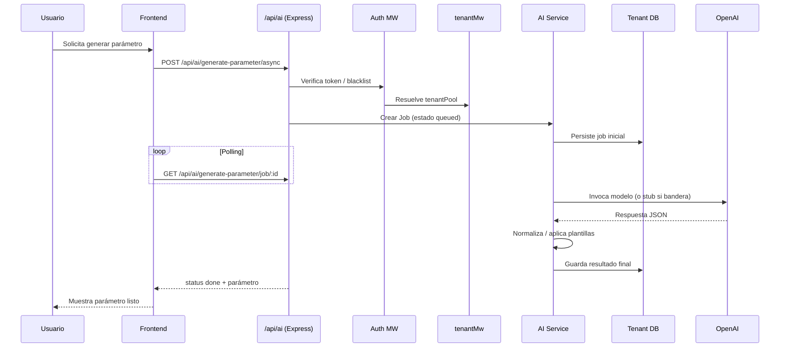
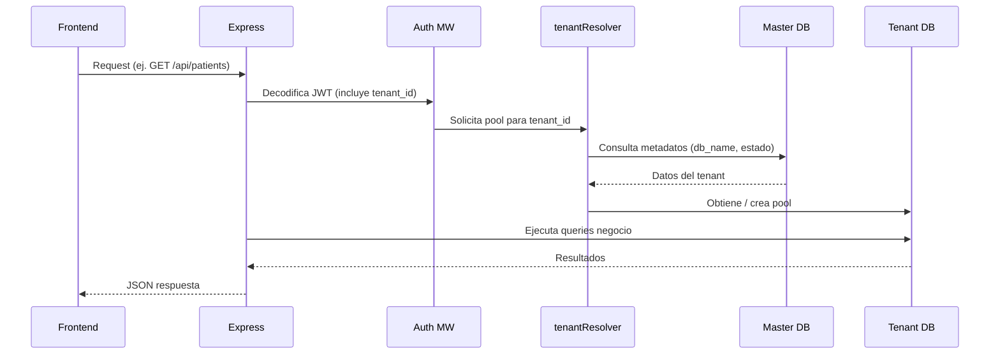

# Arquitectura General de la Aplicación

Este documento resume la arquitectura actual de LabG40 ("labpostgres") incluyendo componentes lógicos, capas, flujo de generación de parámetro por IA, multi‑tenancy, despliegue y puntos de extensión futuros.

## 1. Vista Lógica de Componentes

```mermaid
flowchart LR
  subgraph FE[Frontend (React + Vite + Tailwind)]
    UI[UI / Pages\nContextos\nTema / Auth]
    APIClient[apiClient.js]
  end

  subgraph BE[Backend Express / Node]
    Auth[Auth & Tokens\n(jti, token_version, blacklist)]
    Routes[Rutas REST\n(patients, analysis, orders, ai, config, antibiogram,...)]
    Services[Servicios / Lógica\n(IA assist, normalización, plantillas)]
    Middleware[Middlewares\n(CORS, security, rate limit, requestId, tenantMw)]
    Metrics[Métricas Prometheus]
    Uploads[Static /uploads]
  end

  subgraph MT[Multi-Tenancy Opcional]
    MasterDB[(DB Maestra\n tenants / admins / events )]
    Resolver[tenantResolver\n(pool dinámico)]
  end

  subgraph TenantDBs[PostgreSQL Tenants]
    DB1[(DB lab_demo)]
    DBn[(DB lab_<slug> ...)]
  end

  subgraph External[Infra Opcional]
    Redis[(Redis\nblacklist tokens / activos)]
    OpenAI[(OpenAI API)]
    Nginx[(Nginx Reverse Proxy)]
  end

  FE -->|HTTP / JSON (/api)| BE
  BE -->|Resolve tenant| Resolver --> TenantDBs
  Resolver --> MasterDB
  BE --> Metrics
  BE --> Redis
  BE --> OpenAI
  FE -->|Static assets| Nginx
  Nginx --> FE
  Nginx --> BE
  BE --> Uploads
```

## 2. Vista de Capas

```mermaid
flowchart TB
  UI[Frontend React Components] --> ClientLib[apiClient / utils]
  ClientLib --> HTTP[(HTTP Requests / Fetch)]
  HTTP --> API[Express Routing Layer]
  API --> MW[Middlewares (Auth, Tenant, Security, RateLimit)]
  MW --> Domain[Servicios de Dominio / Normalización / Plantillas]
  Domain --> Persistence[Data Access (Pool / tenantPool)]
  Persistence --> PG[(PostgreSQL)]
  Domain --> Integrations[Integraciones (OpenAI, Redis)]
  API --> Metrics[(Prometheus / Exposición)]
```

## 3. Flujo IA – Generación de Parámetro Individual



## 4. Multi‑Tenancy – Flujo de Resolución



## 5. Despliegue (Nginx + Systemd + Certbot)

### 5.1. Piezas en `deploy/`
| Archivo | Propósito |
|---------|-----------|
| `labg40-api.service` | Unidad systemd para el backend Node (Express). |
| `labg40-migrations.service` / `.timer` | Ejecuta migraciones/consolidaciones en intervalos o al arranque. |
| `check-reference-duplicates.service` / `.timer` | Tareas de higiene para detectar duplicados persistentes de rangos. |
| `nginx-labg40.conf` | Reverse proxy: sirve frontend (build estática) y enruta `/api` al backend. |
| `backfill-qualitative.service` | Job puntual de normalización/backfill de parámetros cualitativos. |
| `deploy.sh` | Script automatizado de build + reinicio de servicios. |
| `setup_certbot.sh` | Obtención/renovación de certificados TLS. |

### 5.2. Flujo de Despliegue Típico
1. Construir frontend (Vite build) y colocar artefactos en directorio servido por Nginx.
2. Reiniciar servicio backend (`systemctl restart labg40-api`).
3. Ejecutar script de migraciones consolidado o permitir que el timer periódicamente las aplique.
4. Nginx expone puerto 80/443 → proxy a backend (ej. `http://localhost:4100`).
5. Certbot renueva certificados y recarga Nginx automáticamente.

### 5.3. Diagrama Simplificado de Despliegue
```mermaid
flowchart LR
  Dev[Desarrollador] --> Build[Construir Frontend (Vite)]
  Build --> Artifacts[Artefactos estáticos]
  Dev --> BackendCode[Node/Express]
  BackendCode --> Systemd[labg40-api.service]
  Systemd --> AppPort[(Puerto 4100)]
  Artifacts --> Nginx
  Nginx -->|/ (static)| Browser
  Browser -->|/api/*| Nginx --> AppPort
  Certbot[Certbot TLS] --> Nginx
  Timers[Systemd Timers] --> Maint[Jobs mantenimiento: migraciones / limpieza]
```

## 6. Seguridad Destacada
| Aspecto | Descripción |
|---------|-------------|
| Tokens | JWT con `jti` y `token_version`, blacklist en memoria o Redis. |
| Secretos | Enmascarados y con metadatos; validación de formato previa. |
| `labInfo` | Protegido: requiere `forceUnlock` para cambios. |
| Rate Limiting | Mutaciones sensibles (config/integrations) limitadas por IP. |
| Logging | Redacción de claves y cabeceras sensibles; requestId correlativo. |

## 7. Normalización y Datos
| Dominio | Regla |
|---------|-------|
| Sexo Rangos | Solo `Ambos`, `Masculino`, `Femenino`. |
| Unidad Edad | `días`, `meses`, `años` (normalizado). |
| Duplicados | Índices únicos compuestos en parámetros y rangos. |
| Decimales | Constraint `decimal_places >= 0`. |
| IA Plantillas | Overrides para parámetros hematológicos (rangos segmentados completos). |

## 8. Métricas y Observabilidad
| Métrica | Descripción |
|---------|------------|
| `http_request_duration_seconds` | Latencia por endpoint y método. |
| `auth_token_revocations_total{reason}` | Revocaciones por causa (logout, admin). |
| `auth_token_version_mismatch_total` | Intentos con versión de token inválida. |
| `auth_token_jti_blacklist_hits_total` | Peticiones con `jti` revocado. |
| Pool DB | Gauges de conexiones activas (per pool). |
| Lag Event Loop | Máximo/último lag sample para detectar saturación. |

## 9. Puntos de Extensión Futuros
- Integrar más proveedores IA (Anthropic, DeepSeek) bajo la misma abstracción.
- Capa de repositorio aislada para facilitar test unitario sin DB real.
- Event bus (Kafka/Redis Streams) para auditoría y notificaciones.
- AJV formal en respuestas IA (strict schema) previo a persistir.
- Métricas etiquetadas por `tenant_id` y dashboards de uso por laboratorio.
- Pre‑generación de reportes PDF vía cola (wkhtmltopdf o Playwright) para cargas altas.

## 10. Resumen Ejecutivo
Arquitectura modular React (frontend) + Express/Node (backend) sobre PostgreSQL con opción multi‑tenant, seguridad reforzada (tokens versionados, masking de secretos), normalización clínica (rangos y parámetros), asistencia IA con fallback determinista, observabilidad (Prometheus + health + lag), y despliegue estándar Nginx + systemd + Certbot. Preparada para escalar en número de laboratorios y extender capacidades de IA y auditoría.

---
Última actualización: {{DATE:2025-11-08}}
Autor: Generado automáticamente (asistente)
